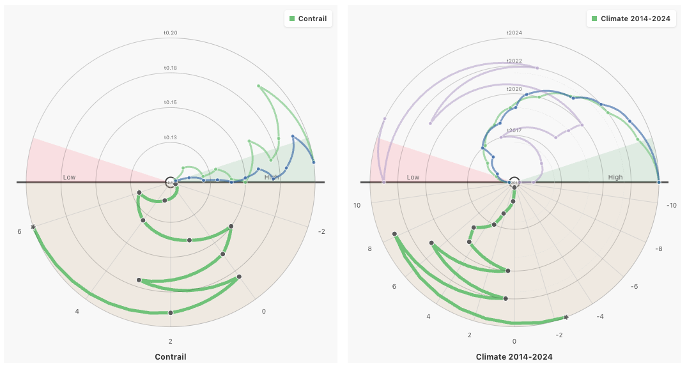

# Loom: General Trajectory Glyph

This repository provides a reusable General Trajectory Glyph component for **[Loom](https://github.com/ScheWann/Loom)**, designed to visualize both path evolution and multi-metric variation in a single view for time-progressive data.



## What Data Is Demonstrated

This repository currently includes two integrated non-biology-related demo datasets:

1. Climate 2014-2024  
	Source: https://www.kaggle.com/datasets/sergionefedov/climate-and-weather-anomalies-196-cities-75-years
- Built from climate-related source tables, including temperature anomalies, CO2, CH4, sea level, extreme events, and climate indices.
- Focus: compare coordinated changes across multiple climate variables on the same time axis.

2. Contrail  
	Source: https://github.com/nafiul-nipu/Contrails
- Built from contrail network and clustering data, including node attributes, network links, and time-slice cluster outputs.
- Focus: show trajectory evolution in cluster space together with synchronized attribute trends such as length and mass.

Glyph encoding overview:

- Lower semicircle: trajectory evolution. Radius encodes time progression; angle encodes categorical or numeric axis values.
- Upper semicircle: multiple metric series. Radius encodes time; angle encodes metric magnitude (typically normalized to [0,1]).
- Interaction: tooltip on hover, legend-linked highlighting, and click-to-select trajectories.

## Requirements For Using This Glyph

### 1. Runtime Requirements

- Node.js 18+ (LTS recommended)
- npm 9+
- Dependencies: React 19 and D3 7

Run locally:

```bash
cd Frontend
npm install
npm run dev
```

### 2. Data Input Check

For data input, just check these files:

- Frontend/src/data/climateGlyph.json
- Frontend/src/data/contrails2MaxClusterGlyph.json
- Frontend/src/GeneralTrajectoryGlyph.jsx (see adaptDemoJsonToGlyphPayload)

If your data follows the same structure as those JSON files, it can be rendered directly by the glyph component.

### 3. Minimal Usage Example

```jsx
import { GeneralTrajectoryGlyph } from "./GeneralTrajectoryGlyph.jsx";
import demoData from "./data/contrails2MaxClusterGlyph.json";

export default function Example() {
	return (
		<div style={{ width: 560, height: 560 }}>
			<GeneralTrajectoryGlyph demoData={demoData} title="Contrail" />
		</div>
	);
}
```

## Typical Use Cases

- Synchronized comparison of multivariate time series
- Visualization of trajectory or state-transition processes
- Analysis scenarios that need both structural evolution and metric variation in one glyph
